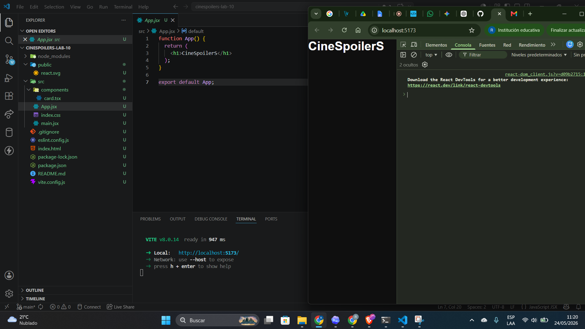
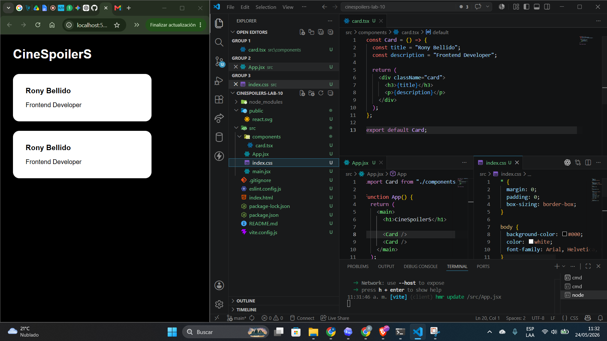
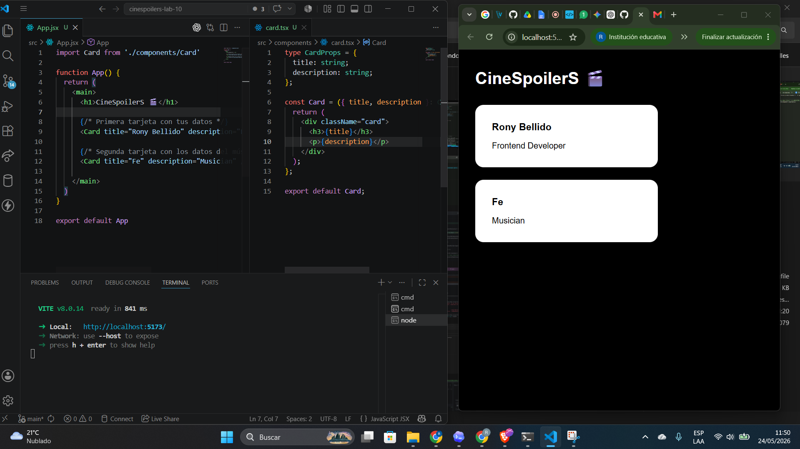
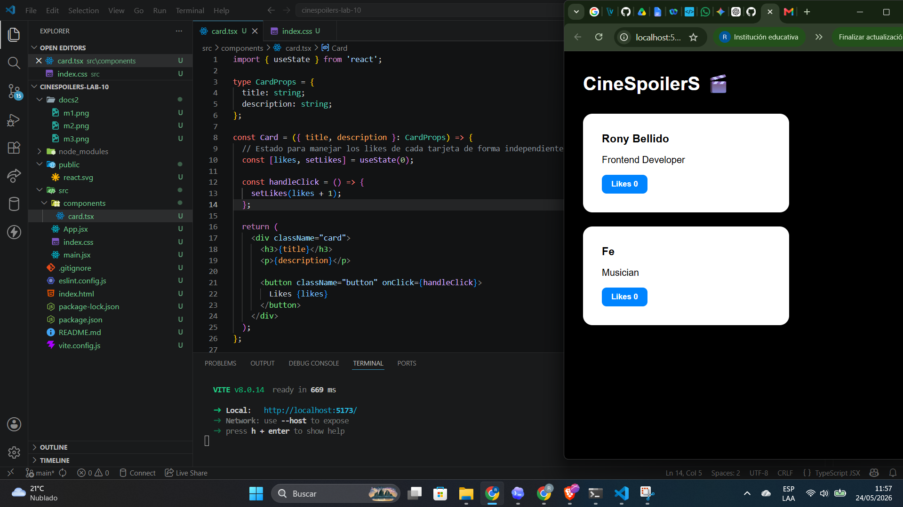
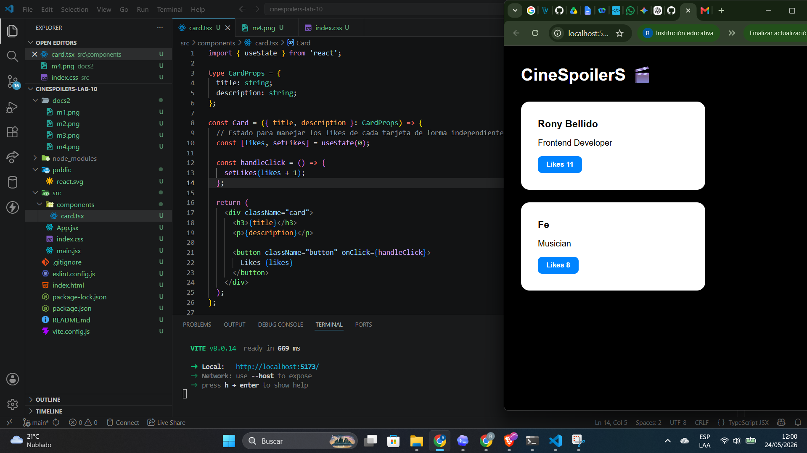

## LABORATORIO 10 DE DESARROLLO DE APLICACIONES EMPRESARIALES
# Ingredientes: 

## 1. Bellido Chambi Rony Widmer
## 2. Rojas Tello, Mauricio Lucianno
## 3. Xiomara Garcia Silva

# CAPTURAS DEL PROYECTO 📸
#

# 1. Bellido Chambi Rony Widmer

### 🔹 ADD COMPONENTE :

### 🔹 AÑADIR CARDS :

### 🔹 AÑADIR CARDPROPS :

### 🔹 ADD ESTADO :

### 🔹 MANEJO DE ESTADO :

# 2. Xiomara Garcia Silva

# 3. Mauricio Rojas
